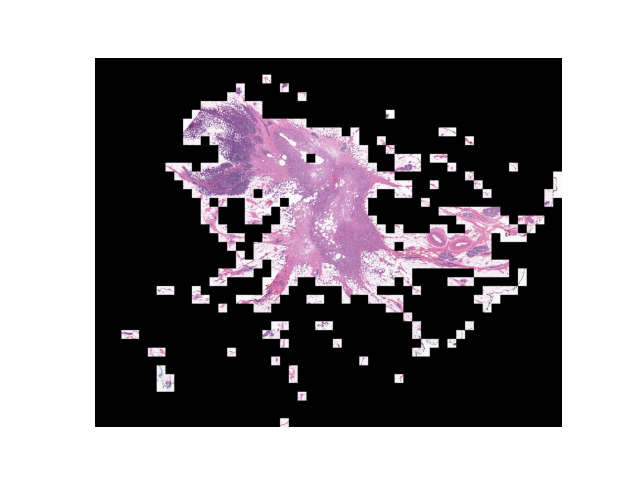
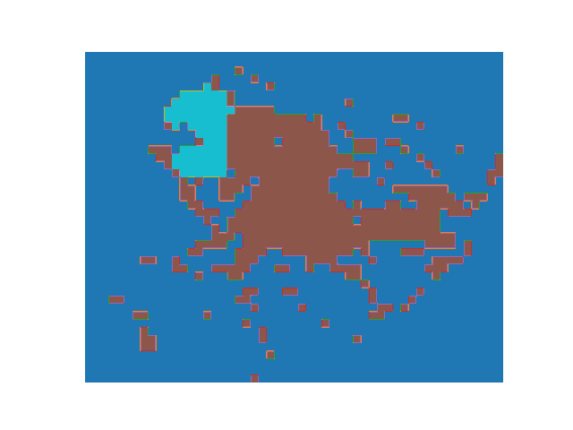
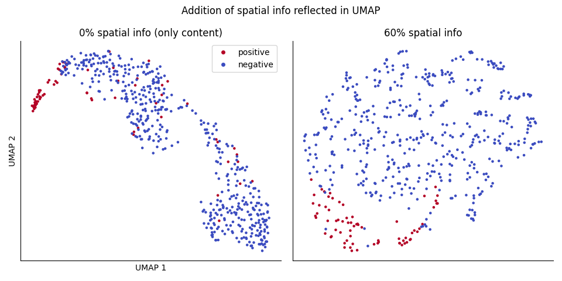
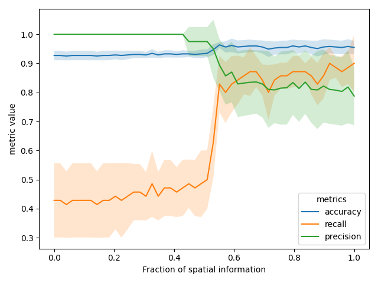

# Regularize image embedding with spatial continuity prior

Clustering image patches of a giant histopathological image allows highlighting of regions of similar texture, with applications like image retrieval [1] and image segmentation [2-3]. Common practices of image clustering and classification are solely based on image content, and hence treating each patch independently. In certain cases, patches next to each other are more likely to have same or similar labels, reflecting the spatial continuity nature of the label. Such information can be introduced to image clustering through methods like supervised dimension reduction [4], providing extra information and therefore better clustering/classification quality.

This repo is a simple example of regularizing image embedding with spatial continuity prior applied to Kaggle breast histopathology image dataset [5]. Whole-slide images (Figure 1) were provided as image patches. Each patch was labeled with absense (label 0) or present (label 1) of invasive ductal carcinoma (IDC) (Figure 2). It's obvious that patches labeled as IDC are within one continuous region (spatial continuity), and a classification model would benefit from having this information incorporated.

  
Figure 1. Reconstructed whole-slide image of patient `10253`. Absence of patches, likely with no tissue and therefore image not included in the dataset, are shown in black.

  
Figure 2. Reconstructed labels of whole-slide image of patient `10253`. Color code: background (navy), brown (not invasive ductal carcinoma (IDC), label 0), cyan (IDC, label 1).

 

To demonstrate this method, the patches were first converted to 50-dimension latent vectoros by a convolution autoencoder (`code/autoencoder.py`). This process treats each image patch independently and hence the latent vectors contain only image content information. The 50-dimension latent vectors were then reduced to 2-dimension using UMAP, with and without using the patch coordinate within the whole-slide image for L2 regularization (Figure 3). Notably, the `umap-learn` implementation [4] includes tunable regularization strength, allowing incorporation of different confidence of the spatial continuity across applications.

 

  
Figure 3. UMAP visualization of the 50-dimension latent vectors of image patches. Each dot represents one image patch. Positive/negative in the color legend refers to 0/1 labels of invasive ductal carcinoma (IDC).

 

To demonstrate the value gain in image clustering & classification, a support vector machine (SVM) classifier was trained and the 5-fold cross-validation metrics (accuracy, precision, recall) were recorded (Figure 4). Note that only 70 out of 549 image patches (12.75%) in this whole-slide image were labeled as positive, a typical class imbalance issue in histopathology image labels, reflected on the low recall but high accuracy at 0% spatial information (Figure 4). Depending on the application/situation, false positive may be less of a concern compared to false negative, and hence one may choose to go for higher recall and follow up with cost-effective validation to identify false positives (as in 60% spatial information) compared to lower recall where screening for false negative takes more time/effort/resource (as in 0% spatial information).

 

  
Figure 4. 5-fold cross-validation metrics (accuracy, precision, recall) of a support vector machine (SVM) classifier for predicting patch labels (present/absence of invasive ductal carcinoma), using the 2-dimension UMAP embedding with different weights of patch coordinate for regularization of spatial continuity. Style code: average (solid line) and +/- one standard deviation (filled area) of the 5-fold cross-validation metrics.

 

In conclusion, this repo demonstrates a simple method to incorporate spatial continuity knowledge/prior belief in image clustering/classification. In many cases, more complex spatial information may be incorporated in similar ways, ex. a patch between patches of tumor grade 1 and 3 are more likely to be grade 1-3 than no tumor or grade 4-5.

## Reference
[1] Barcode Annotations for Medical Image Retrieval: A Preliminary Investigation ([arxiv](https://arxiv.org/abs/1505.05212))  
[2] Atlas of Digital Pathology: A Generalized Hierarchical Histological Tissue Type-Annotated Database for Deep Learning ([DOI](https://doi.org/10.1109/CVPR.2019.01202))  
[3] HistoSegNet: Semantic Segmentation of Histological Tissue Type in Whole Slide Images ([DOI](https://doi.org/10.1109/ICCV.2019.01076))  
[4] UMAP for Supervised Dimension Reduction and Metric Learning ([link](https://umap-learn.readthedocs.io/en/latest/supervised.html))  
[5] Kaggle Breast Histopathology Images ([link](https://www.kaggle.com/paultimothymooney/breast-histopathology-images))
